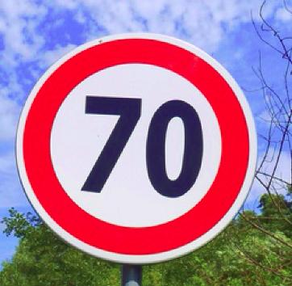
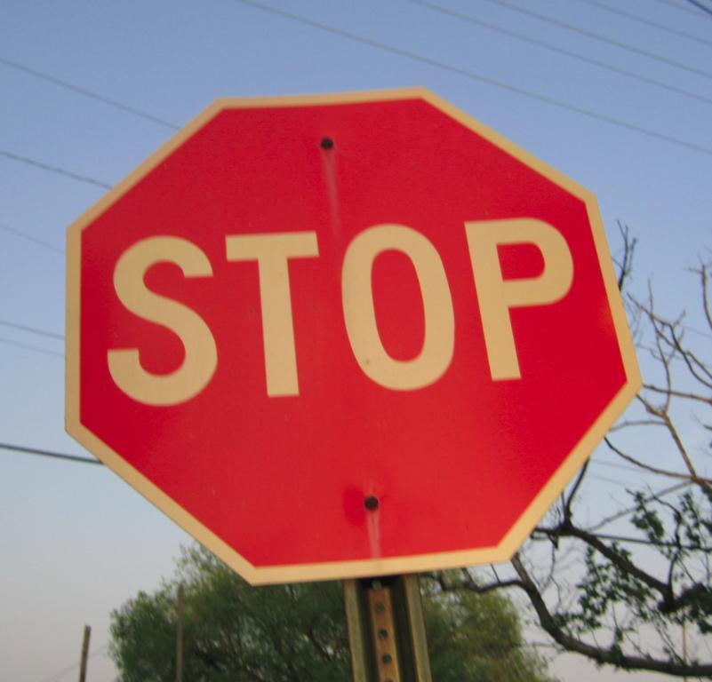
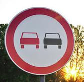
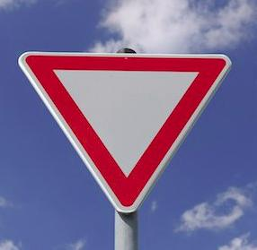

# **Traffic Sign Recognition** 

## Writeup

---

**Build a Traffic Sign Recognition Project**

The goals / steps of this project are the following:
* Load the data set (see below for links to the project data set)
* Explore, summarize and visualize the data set
* Design, train and test a model architecture
* Use the model to make predictions on new images
* Analyze the softmax probabilities of the new images
* Summarize the results with a written report

---
### Writeup / README

#### 1. Provide a Writeup / README that includes all the rubric points and how you addressed each one. You can submit your writeup as markdown or pdf. You can use this template as a guide for writing the report. The submission includes the project code.

You're reading it! and here is a link to my [project code](Traffic_Sign_Classifier.html)

### Data Set Summary & Exploration

#### 1. Provide a basic summary of the data set. In the code, the analysis should be done using python, numpy and/or pandas methods rather than hardcoding results manually.

The German traffic dataset consists of labeled 32x32 colored images of traffic signs. Traffic signs in images are taken from various angles and brightness.

I used the numpy library to calculate summary statistics of the traffic
signs data set:

* The size of training set is 34799
* The size of the validation set is 4410
* The size of test set is 12630
* The shape of a traffic sign image is 32x32
* The number of unique classes/labels in the data set is 43

#### 2. Include an exploratory visualization of the dataset.

For details, please see the [jupyter notebook](Traffic_Sign_Classifier.html).

### Design and Test a Model Architecture

#### 1. Describe how you preprocessed the image data. What techniques were chosen and why did you choose these techniques? Consider including images showing the output of each preprocessing technique. Pre-processing refers to techniques such as converting to grayscale, normalization, etc. (OPTIONAL: As described in the "Stand Out Suggestions" part of the rubric, if you generated additional data for training, describe why you decided to generate additional data, how you generated the data, and provide example images of the additional data. Then describe the characteristics of the augmented training set like number of images in the set, number of images for each class, etc.)

I normalized the data so that it has mean zero and equal variance. 

For that, I used (pixel - 128) / 128.

I decided against converting them to grayscale, since color is a very important aspect to traffic signs. Converting to grayscale will result in loss of information. 
For instance, blue signs usually mean directions and yellow signs usually mean alert.

#### 2. Describe what your final model architecture looks like including model type, layers, layer sizes, connectivity, etc.) Consider including a diagram and/or table describing the final model.

My final model consisted of the following layers:

| Layer         		|     Description	        					| 
|:---------------------:|:---------------------------------------------:| 
| Input         		| 32x32x3 RGB image   							| 
| Convolution 5x5     	| 1x1 stride, valid padding, outputs 28x28x10 	|
| RELU					|												|
| Max pooling	      	| 2x2 stride,  outputs 14x14x10 				|
| Convolution 5x5     	| 1x1 stride, valid padding, outputs 10x10x25 	|
| RELU					|												|
| Max pooling	      	| 2x2 stride,  outputs 5x5x25   				|
| Fully connected		| 625 -> 220  									|
| RELU					|												|
| Fully connected		| 220 -> 100  									|
| RELU					|												|
| Fully connected		| 100 -> 43  									|
 
 

#### 3. Describe how you trained your model. The discussion can include the type of optimizer, the batch size, number of epochs and any hyperparameters such as learning rate.

* Optimizer: Adam optimizer
* Batch size: 64
* No. of epochs: 10
* Learning rate: 0.002

#### 4. Describe the approach taken for finding a solution and getting the validation set accuracy to be at least 0.93. Include in the discussion the results on the training, validation and test sets and where in the code these were calculated. Your approach may have been an iterative process, in which case, outline the steps you took to get to the final solution and why you chose those steps. Perhaps your solution involved an already well known implementation or architecture. In this case, discuss why you think the architecture is suitable for the current problem.

My final model results were:
* validation set accuracy of 94.15% 
* test set accuracy of 93.58%

If a well known architecture was chosen:
* What architecture was chosen?   **Lenet**
* Why did you believe it would be relevant to the traffic sign application?   **It was suggested by instructor. Also, data input is in very similar dimension.**
* How does the final model's accuracy on the training, validation and test set provide evidence that the model is working well?   **The test data is not used at all in training. So achieveing 93% accuracy on 12k+ data is assuring.**
 

### Test a Model on New Images

#### 1. Choose five German traffic signs found on the web and provide them in the report. For each image, discuss what quality or qualities might be difficult to classify.

Here are five German traffic signs that I found on the web:

Each images should be not hard to classify, since they are in relative good quality.

#### 2. Discuss the model's predictions on these new traffic signs and compare the results to predicting on the test set. At a minimum, discuss what the predictions were, the accuracy on these new predictions, and compare the accuracy to the accuracy on the test set (OPTIONAL: Discuss the results in more detail as described in the "Stand Out Suggestions" part of the rubric).

Here are the results of the prediction:

| Image			        |     Prediction	        					| 
|:---------------------:|:---------------------------------------------:| 
| 70 km/h	      		| 70 km/h   					 				|
| Stop Sign      		| Stop sign   									| 
| No passing			| No passing          							|
| Yield					| Yield											|
| Priority road 		| Priority road 								|

The model was able to correctly guess 5 of the 5 traffic signs, which gives an accuracy of 100%. This compares favorably to the accuracy on the test set of 93.58%.

#### 3. Describe how certain the model is when predicting on each of the five new images by looking at the softmax probabilities for each prediction. Provide the top 5 softmax probabilities for each image along with the sign type of each probability. (OPTIONAL: as described in the "Stand Out Suggestions" part of the rubric, visualizations can also be provided such as bar charts)

The code for making predictions on my final model is located in the 11th cell of the Ipython notebook.

For the all images, the model is almost absolutely certain of the outcome.

##### 1st image
| Probability         	|     Prediction	        					| 
|:---------------------:|:---------------------------------------------:| 
| 1.0         			| 70 km/h                                       |
| 1e-30    				| 20 km/h 										|
| 1e-34					| 100 km/h										|
| 1e-37	      			| 30 km/h   					 				|
| 1e-38				    | 3.5t prohibited      							|

##### 2nd image
| Probability         	|     Prediction	        					| 
|:---------------------:|:---------------------------------------------:| 
| 1.0         			| Stop sign                                     |
| 1e-12    				| 80 km/h 										|
| 1e-13					| 30 km/h										|
| 1e-16	      			| Road work   					 				|
| 1e-23					| 60 km/h										|

##### 3rd image
| Probability         	|     Prediction	        					| 
|:---------------------:|:---------------------------------------------:| 
| 1.0         			| No passing                                    |
| 1e-19    				| End of no passing								|
| 1e-23					| 120 km/h										|
| 1e-24	      			| Dangerous curve to the right	 				|
| 1e-25				    | Go straight or right                          |

##### 4th image
| Probability         	|     Prediction	        					| 
|:---------------------:|:---------------------------------------------:| 
| 1.0         			| Yield                                         |
| 1e-33    				| 60 km/h 										|
| 1e-34					| No passing                                    |
| 1e-37	      			| Keep right   					 				|
| 0.00				    | 20 km/h                                       |

##### 5th image
| Probability         	|     Prediction	        					| 
|:---------------------:|:---------------------------------------------:| 
| 1.0         			| Priority road                                 |
| 1e-21	      			| Keep right   					 				|
| 1e-22        			| Stop sign                                     |
| 1e-22	      			| End of all speed and passing limits			|
| 1e-24	      			| End of no passing                             |

### (Optional) Visualizing the Neural Network (See Step 4 of the Ipython notebook for more details)
#### 1. Discuss the visual output of your trained network's feature maps. What characteristics did the neural network use to make classifications?

It is obvious that the layer uses the shape of the sign as a characteristic for the classification.

For details, please see the [jupyter notebook](Traffic_Sign_Classifier.html). As shown, the feature maps all show triangular shapes of the yield sign.
